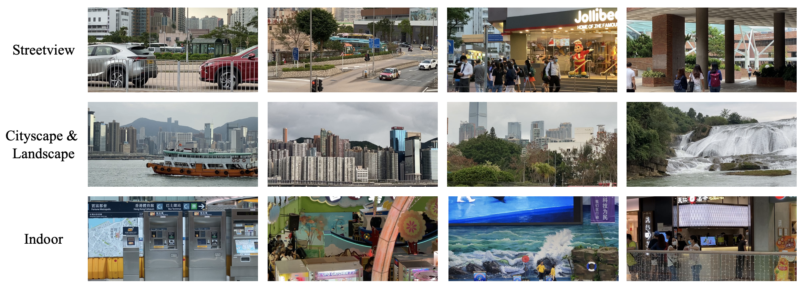

# Dataset and Code for RealVSR

>[Real-world Video Super-resolution: A Benchmark Dataset and A Decomposition based Learning Scheme](https://www4.comp.polyu.edu.hk/~cslzhang/paper/ICCV21_RealVSR.pdf) \
>Xi Yang, Wangmeng Xiang, Hui Zeng and Lei Zhang \
>International Conference on Computer Vision, 2021.

## Dataset

The dataset is hosted on [Google Drive](https://drive.google.com/drive/folders/1-8MvMEYMOeOE713DjI7TJKyRE-LnrM3Y?usp=sharing) and [Baidu Drive](https://pan.baidu.com/s/1rBIGo5xrY2VtpoUF2gf_HA) (code: 43ph). Some example scenes are shown below.



The structure of the dataset is illustrated below.

| File                     | Description                                 |
| ------------------------ |:-------------------------------------------:|
| GT.zip                   | All ground truth sequences in RGB format    |
| LQ.zip                   | All low quality sequences in RGB format     |
| GT_YCbCr.zip             | All ground truth sequences in YCbCr format  |
| LQ_YCbCr.zip             | All low quality sequences in YCbCr format   |
| GT_test.zip              | Ground truth test sequences in RGB format   |
| LQ_test.zip              | Low Quality test sequences in RGB format    |
| GT_YCbCr_test.zip        | Ground truth test sequences in YCbCr format |
| LQ_YCbCr_test.zip        | Low Quality test sequences in YCbCr format  |

## Code

### Dependencies
* Linux *(tested on Ubuntu 18.04)*
* Python 3 *(tested on python 3.7)*
* NVIDIA GPU + CUDA *(tested on CUDA 10.2 and 11.1)*

### Installation
```
# Create a new anaconda python environment (realvsr)
conda create -n realvsr python=3.7 -y

# Activate the created environment
conda activate realvsr

# Install dependencies
pip install -r requirements.txt

# Bulid the DCN module
cd codes/models/archs/dcn
python setup.py develop
```

### Training

Modify the configuration files accordingly in codes/options/train folder and run the following command (current we did not implement distributed training):
```
python train.py -opt xxxxx.yml
```

### Testing

#### Test on RealVSR testing set sequences:
Modify the configuration in test_RealVSR_wi_GT.py and run the following command:
```
python test_RealVSR_wi_GT.py
```

#### Test on real-world captured sequences:
Modify the configuration in test_RealVSR_wo_GT.py and run the following command:
```
python test_RealVSR_wo_GT.py
```

## License

This project is released under the Apache 2.0 license.

## Citation

If you find this code useful in your research, please consider citing:
``` latex
@article{yang2021real,
  title={Real-world Video Super-resolution: A Benchmark Dataset and A Decomposition based Learning Scheme},
  author={YANG, Xi and Xiang, Wangmeng and Zeng, Hui and Zhang, Lei},
  journal=ICCV,
  year={2021}
}
```

## Acknowledgement

This implementation largely depends on [EDVR](https://github.com/xinntao/EDVR). Thanks for the excellent codebase! You may also consider migrating it to [BasicSR](https://github.com/xinntao/BasicSR).
